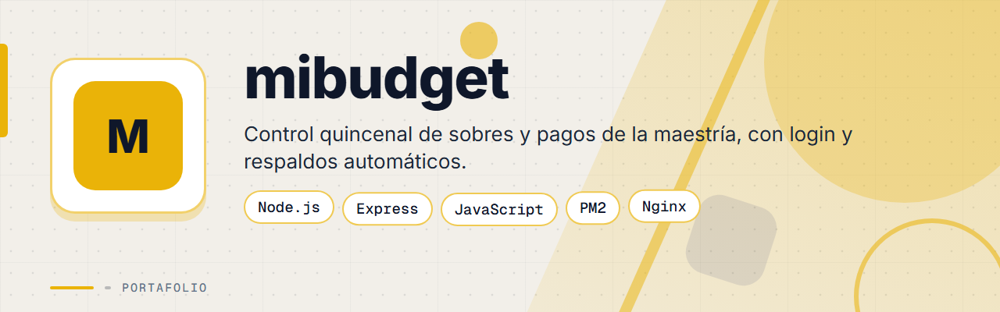
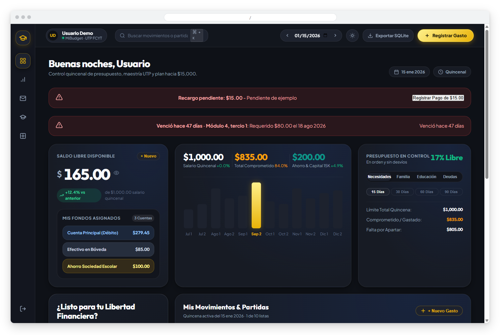
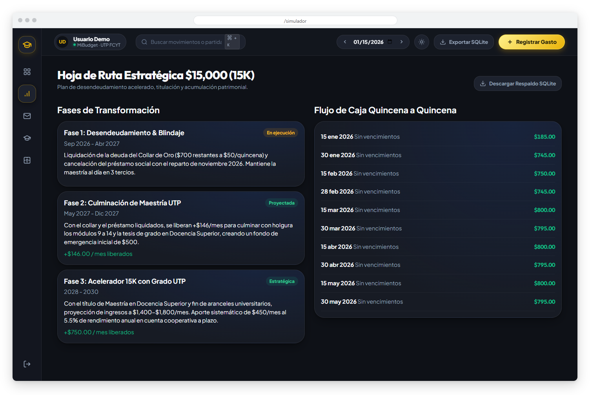
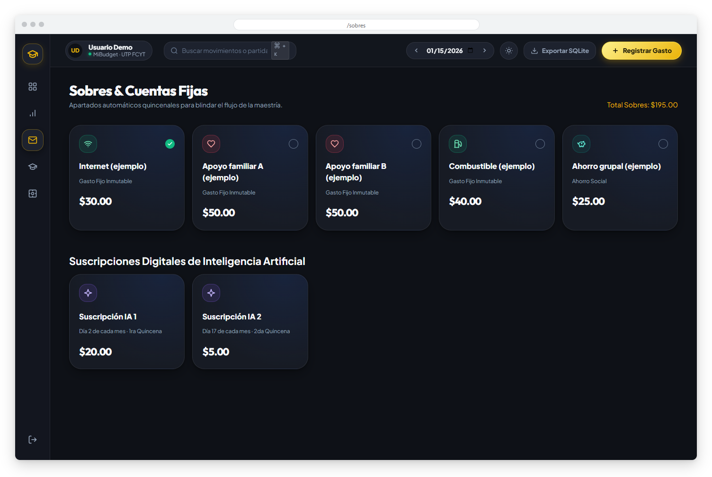
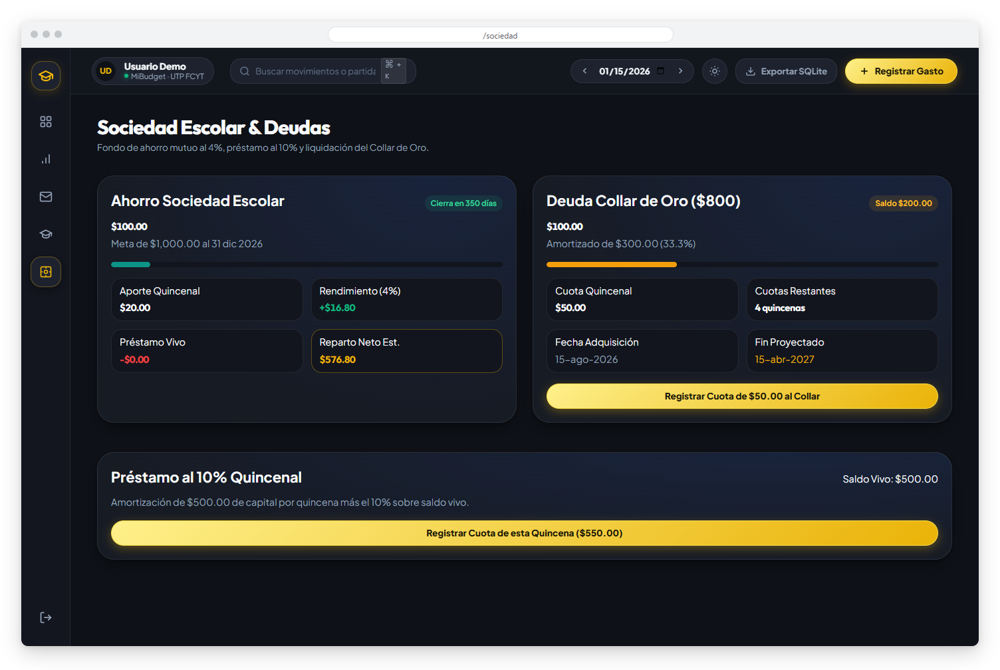
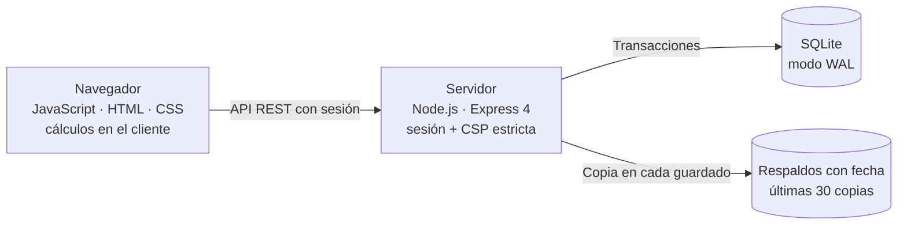

<div align="center">



# mibudget


**Aplicación web de presupuesto quincenal: reparte cada quincena en sobres, controla cuentas fijas, deudas y ahorro, proyecta el flujo de caja y protege todo con inicio de sesión y respaldos automáticos.**

</div>

> Este es un **portafolio showcase**: el código fuente es propietario y no está incluido. Las capturas usan datos de ejemplo.

---

## Contenido

- [El Problema](#el-problema)
- [La Solución](#la-solución)
- [Funcionalidades](#funcionalidades)
- [Vista Previa](#vista-previa)
- [Arquitectura](#arquitectura)
- [Stack Tecnológico](#stack-tecnológico)
- [Instalación local](#instalación-local)
- [Roadmap](#roadmap)
- [Contacto](#contacto)

---

## El Problema

Llevar el presupuesto personal en una hoja de cálculo se vuelve difícil cuando se cobra por quincena:

- No es claro cuánto queda libre después de apartar lo que ya está comprometido.
- Los pagos fijos, las suscripciones y las deudas se pierden entre filas.
- Proyectar el ahorro y el pago de un préstamo exige fórmulas fáciles de romper.
- Los datos financieros deben estar protegidos y respaldados.

---

## La Solución

Una aplicación ligera con un servidor Express y una interfaz en JavaScript sin frameworks pesados. Cada quincena se reparte en sobres y cuentas fijas, el simulador proyecta el flujo de caja y la amortización, y todo el estado se guarda en SQLite con copias de respaldo con fecha. El acceso se protege con contraseña y una política de seguridad de contenido (CSP) estricta.

---

## Funcionalidades

| Funcionalidad | Descripción |
|---------------|-------------|
| Panel de inicio | Saldo libre disponible, fondos asignados por cuenta y presupuesto de la quincena |
| Sobres y cuentas fijas | Apartados quincenales y suscripciones con su estado de pago |
| Simulador y proyección | Hoja de ruta por fases y flujo de caja proyectado quincena a quincena |
| Ahorro y deudas | Ahorro grupal con rendimiento, amortización de deudas y préstamo quincenal |
| Respaldos | Copia con fecha en cada guardado (se conservan las últimas 30), descarga de respaldo y exportación a SQLite |
| Persistencia segura | SQLite en modo WAL con transacciones y escritura atómica |
| Acceso protegido | Inicio de sesión con contraseña y CSP estricta en el navegador |
| Pruebas automáticas | Pruebas con el ejecutor nativo de Node.js sobre los cálculos, la API y la base de datos |

---

## Vista Previa



<table>
  <tr>
    <td width="50%">
      
      <br><b>Hoja de ruta</b>: fases del plan financiero y flujo de caja quincena a quincena.
    </td>
    <td width="50%">
      
      <br><b>Sobres y cuentas fijas</b>: apartados quincenales y suscripciones con su estado.
    </td>
  </tr>
  <tr>
    <td width="50%">
      
      <br><b>Ahorro y deudas</b>: ahorro grupal, amortización de una deuda y préstamo quincenal.
    </td>
    <td width="50%"></td>
  </tr>
</table>

---

## Arquitectura



**Rutas del servidor:** autenticación, presupuesto y respaldos. La política CSP prohíbe scripts y estilos en línea, así que los valores dinámicos se aplican desde JavaScript.

---

## Stack Tecnológico

| Capa | Tecnología |
|------|-----------|
| Frontend | JavaScript sin frameworks · HTML · CSS |
| Backend | Node.js · Express 4 |
| Datos | SQLite nativo de Node.js (modo WAL) |
| Seguridad | Sesiones con contraseña · CSP estricta |
| Pruebas | Ejecutor de pruebas nativo de Node.js |
| Despliegue | PM2 · Nginx |

---

## Instalación local

> **Aviso:** el código es privado y propietario. Estos pasos son solo para colaboradores autorizados con acceso al repositorio.

1. Instala una versión reciente de Node.js.
2. Instala las dependencias:
   ```bash
   npm install
   ```
3. Crea un archivo `.env` con tus propios valores de acceso y de sesión.
4. Inicia el servidor:
   ```bash
   npm start
   ```
5. Ejecuta las pruebas:
   ```bash
   npm test
   ```

---

## Roadmap

- [ ] Ampliar las pruebas automáticas a las pantallas del frontend.
- [ ] Gráficos adicionales de gasto por categoría.

---

## Contacto

El código fuente es propietario. Para consultas o propuestas, escríbeme:

[](mailto:pablozam1931@gmail.com)
[%206517--1870-25D366?style=for-the-badge&logo=whatsapp&logoColor=white)](https://wa.me/50765171870)
[](https://github.com/deadlyrat)

- Correo: [pablozam1931@gmail.com](mailto:pablozam1931@gmail.com)
- WhatsApp: [(507) 6517-1870](https://wa.me/50765171870)
- GitHub: [github.com/deadlyrat](https://github.com/deadlyrat)

---

*Parte del portafolio de [deadlyrat](https://github.com/deadlyrat)*
